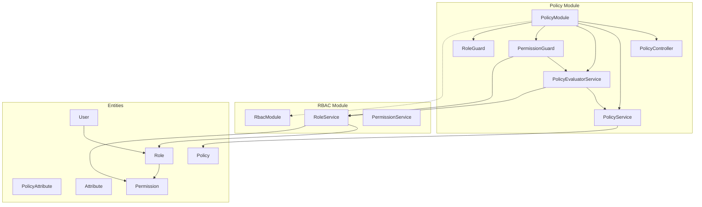
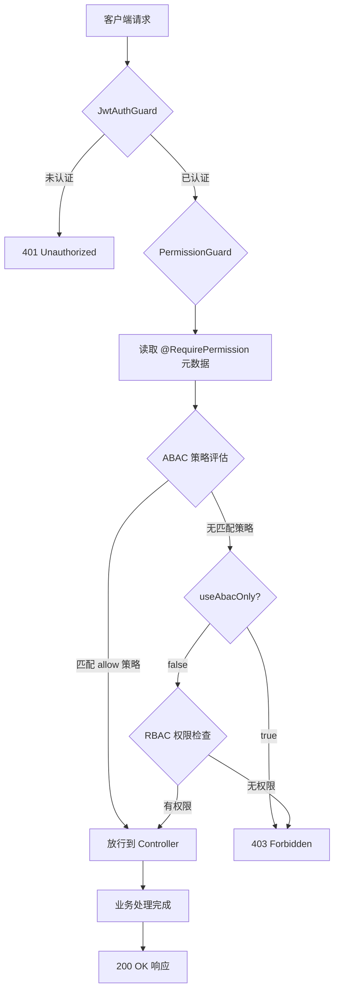
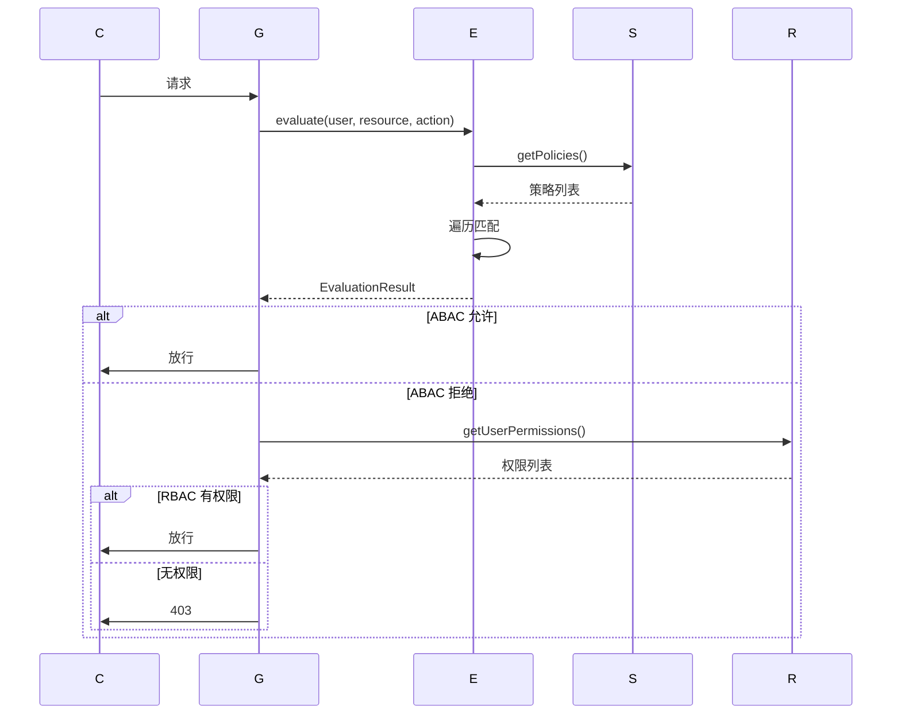

# 权限系统设计文档

**版本**: 1.0  
**最后更新**: 2026-02-21  
**作者**: 系统架构组  
**状态**: 正式发布

---

## 文档说明

本文档使用 Mermaid 图表。请在支持 Mermaid 的 Markdown 查看器中阅读（如 GitHub、VS Code + Mermaid 插件），或访问 [Mermaid Live Editor](https://mermaid.live/) 进行预览。

---

## 目录

1. [概述](#1-概述)
2. [系统架构](#2-系统架构)
3. [术语表](#3-术语表)
4. [数据模型设计](#4-数据模型设计)
5. [API 规范](#5-api-规范)
6. [权限检查流程](#6-权限检查流程)
7. [条件表达式语法](#7-条件表达式语法)
8. [测试策略](#8-测试策略)
9. [部署配置与性能](#9-部署配置与性能)
10. [最佳实践与 FAQ](#10-最佳实践与-faq)
11. [安全建议](#11-安全建议)
12. [扩展性设计](#12-扩展性设计)
13. [版本历史](#13-版本历史)
14. [相关文档](#14-相关文档)
15. [附录](#15-附录)

---

## 1. 概述

### 1.1 背景

本系统是一个基于 NestJS 框架开发的后端服务，需要一套灵活、可扩展的权限控制机制来保护 API 端点和业务资源。传统的 RBAC（基于角色的访问控制）模型在面对复杂权限场景时存在局限性，例如：

- 无法表达"用户只能编辑自己创建的资源"
- 无法根据时间、IP 等环境因素动态决定权限
- 权限变更需要修改代码或重新部署

为了解决这些问题，系统采用了 **ABAC + RBAC 混合权限模型**，以 ABAC 为主、RBAC 为辅，实现细粒度的权限控制。

### 1.2 目标

1. **细粒度控制**：支持基于用户属性、资源属性、环境条件的动态权限判断
2. **向后兼容**：保留 RBAC 作为回退机制，确保现有功能不受影响
3. **可配置性**：权限策略存储在数据库中，支持运行时修改无需重启服务
4. **可审计性**：所有权限决策都有详细日志，便于问题排查和安全审计
5. **高性能**：策略缓存机制减少数据库查询，保证响应速度

### 1.3 范围

**包含**：

- ABAC 策略定义、存储和评估
- RBAC 权限模型（用户-角色-权限）
- NestJS 守卫和装饰器实现
- 策略管理 API
- 权限检查流程

**不包含**：

- 前端权限控制（见前端文档）
- OAuth 认证流程（见认证文档）
- 数据库迁移脚本

### 1.4 技术选型

| 技术选型   | 版本  | 选择理由                                  |
| ---------- | ----- | ----------------------------------------- |
| NestJS     | 11.x  | 企业级 Node.js 框架，原生支持守卫、装饰器 |
| TypeORM    | 0.3.x | 成熟的 ORM，支持复杂实体关系              |
| PostgreSQL | 14+   | 支持 JSONB 类型存储策略条件               |
| Mermaid    | -     | 内嵌图表语法，无需外部工具                |

---

## 2. 系统架构

### 2.1 整体架构

系统采用**混合权限模型**，在请求处理流程中依次执行 ABAC 和 RBAC 检查：

```
┌─────────────────────────────────────────────────────────────────┐
│                        客户端请求                                │
└─────────────────────────────────────────────────────────────────┘
                                 │
                                 ▼
┌─────────────────────────────────────────────────────────────────┐
│                     JwtAuthGuard                                │
│                   (JWT 认证检查)                                 │
└─────────────────────────────────────────────────────────────────┘
                                 │
                                 ▼
┌─────────────────────────────────────────────────────────────────┐
│                    PermissionGuard                              │
│                   (权限检查守卫)                                 │
│  ┌───────────────────────────────────────────────────────────┐  │
│  │  1. 读取 @RequirePermission 装饰器元数据                    │  │
│  │  2. 调用 PolicyEvaluatorService 执行 ABAC 评估             │  │
│  │  3. ABAC 通过 → 放行                                       │  │
│  │  4. ABAC 拒绝 + useAbacOnly=false → 执行 RBAC 回退         │  │
│  │  5. RBAC 通过 → 放行                                       │  │
│  │  6. 全部拒绝 → 抛出 ForbiddenException                     │  │
│  └───────────────────────────────────────────────────────────┘  │
└─────────────────────────────────────────────────────────────────┘
                                 │
                                 ▼
┌─────────────────────────────────────────────────────────────────┐
│                     Controller Handler                          │
│                     (业务处理)                                   │
└─────────────────────────────────────────────────────────────────┘
```

### 2.2 核心组件

| 组件                     | 类型         | 职责                     |
| ------------------------ | ------------ | ------------------------ |
| `PermissionGuard`        | NestJS Guard | 拦截请求，执行权限检查   |
| `RoleGuard`              | NestJS Guard | 简单角色检查（向后兼容） |
| `PolicyEvaluatorService` | Service      | ABAC 策略评估核心逻辑    |
| `PolicyService`          | Service      | 策略 CRUD 操作           |
| `RoleService`            | Service      | 角色和权限管理           |
| `@RequirePermission`     | Decorator    | 声明端点所需权限         |
| `@RequireRole`           | Decorator    | 声明端点所需角色         |

### 2.3 模块依赖



### 2.4 架构图

以下 Mermaid 图展示完整的权限检查流程：



---

## 3. 术语表

> 本节定义文档中使用的核心术语，提供中英文对照。

### 3.1 核心术语

| 术语 (中文)            | 术语 (英文)                           | 定义                                                                                    |
| ---------------------- | ------------------------------------- | --------------------------------------------------------------------------------------- |
| **基于属性的访问控制** | ABAC (Attribute-Based Access Control) | 一种授权模型，访问决策基于主体、资源、操作和环境的属性进行判断，支持细粒度的权限控制。  |
| **基于角色的访问控制** | RBAC (Role-Based Access Control)      | 一种授权模型，权限通过角色分配给用户，用户通过拥有角色获得相应权限。                    |
| **策略**               | Policy                                | 定义访问规则的实体，包含主体、资源、操作、效果和可选条件，用于决定是否允许访问。        |
| **主体**               | Subject                               | 请求访问的实体，可以是用户、角色、部门或其他身份标识，格式如 `user:123`、`role:admin`。 |
| **资源**               | Resource                              | 被访问的对象，如 `user`、`policy`、`audit` 等，支持通配符匹配。                         |
| **操作**               | Action                                | 对资源执行的动作，如 `create`、`read`、`update`、`delete`，支持通配符和组合。           |
| **效果**               | Effect                                | 策略匹配后的决定结果，值为 `allow`（允许）或 `deny`（拒绝）。                           |
| **条件**               | Conditions                            | 策略的可选规则，用于动态决策，如时间限制、IP 范围、资源所有权检查等。                   |
| **优先级**             | Priority                              | 策略的评估顺序，数值越高越先评估，高优先级策略可覆盖低优先级策略。                      |
| **权限守卫**           | PermissionGuard                       | NestJS 守卫组件，在路由处理前执行权限检查，结合 ABAC 和 RBAC 进行授权验证。             |
| **策略评估器**         | PolicyEvaluatorService                | 核心服务，负责加载策略、匹配属性、评估条件并返回授权结果。                              |
| **装饰器**             | Decorator                             | 用于控制器方法的元数据标注，如 `@RequirePermission('user', 'read')` 声明所需权限。      |
| **超级管理员**         | Super Admin                           | 拥有最高权限的特殊角色，优先级通常为 1000，可绕过所有限制。                             |
| **通配符**             | Wildcard                              | 用于模式匹配的特殊字符 `*`，可匹配任意资源或操作，如 `resource: "*"` 匹配所有资源。     |
| **缓存**               | Cache                                 | 策略数据的内存存储，避免频繁数据库查询，通过 TTL 或手动失效机制保持数据新鲜。           |

### 3.2 接口类型

| 术语 (中文)    | 术语 (英文)       | 定义                                                                                        |
| -------------- | ----------------- | ------------------------------------------------------------------------------------------- |
| **用户属性**   | UserAttributes    | ABAC 评估中使用的用户信息接口，包含 id、username、roles、departments 等字段。               |
| **评估上下文** | EvaluationContext | 策略评估的完整上下文，包含用户、资源、操作和可选的环境信息。                                |
| **评估结果**   | EvaluationResult  | 策略评估的返回结果，包含 allowed（是否允许）、matchedPolicy（匹配的策略）、reason（原因）。 |

### 3.3 模式匹配

| 术语 (中文)  | 术语 (英文)      | 定义                                                                              |
| ------------ | ---------------- | --------------------------------------------------------------------------------- |
| **主体模式** | Subject Pattern  | 用于匹配用户的模式格式，如 `user:{id}`、`role:{name}`、`department:{name}`、`*`。 |
| **资源模式** | Resource Pattern | 用于匹配资源的模式格式，支持精确匹配、前缀通配 `prefix:*`、全匹配 `*`。           |
| **操作模式** | Action Pattern   | 用于匹配操作的模式格式，支持精确匹配、通配符 `*`、逗号分隔组合 `read,write`。     |

---

## 4. 数据模型设计

### 4.1 实体关系图

```mermaid
erDiagram
    User ||--o{ UserRole : "拥有"
    Role ||--o{ UserRole : "分配给"
    Role ||--o{ RolePermission : "包含"
    Permission ||--o{ RolePermission : "被引用"
    Policy ||--o{ PolicyAttribute : "包含"
    Attribute ||--o{ PolicyAttribute : "被引用"

    User {
        uuid id PK
        varchar username UK
        varchar email UK
        varchar phone UK
        varchar password_hash
        varchar nickname
        enum status
        timestamp created_at
        timestamp updated_at
        timestamp deleted_at
    }

    Role {
        uuid id PK
        varchar name UK
        varchar description
        boolean is_super_admin
        timestamp created_at
        timestamp updated_at
    }

    Permission {
        uuid id PK
        varchar name UK
        varchar resource
        varchar action
        varchar description
    }

    Policy {
        uuid id PK
        varchar name
        varchar description
        enum effect
        varchar subject
        varchar resource
        varchar action
        jsonb conditions
        int priority
        boolean enabled
        timestamp created_at
        timestamp updated_at
    }

    UserRole {
        uuid user_id FK
        uuid role_id FK
    }

    RolePermission {
        uuid role_id FK
        uuid permission_id FK
    }

    PolicyAttribute {
        uuid policy_id FK
        uuid attribute_id FK
        varchar required_value
    }
}
```

### 4.2 核心实体

#### User（用户）

| 字段     | 类型         | 约束              | 说明                            |
| -------- | ------------ | ----------------- | ------------------------------- |
| id       | uuid         | PK                | 主键，自动生成                  |
| username | varchar(50)  | UK, NOT NULL      | 用户名，唯一                    |
| email    | varchar(255) | UK                | 邮箱，唯一                      |
| status   | enum         | DEFAULT 'pending' | 状态：active, disabled, pending |

#### Role（角色）

| 字段           | 类型        | 约束          | 说明           |
| -------------- | ----------- | ------------- | -------------- |
| id             | uuid        | PK            | 主键           |
| name           | varchar(50) | UK, NOT NULL  | 角色名称       |
| is_super_admin | boolean     | DEFAULT false | 是否超级管理员 |

#### Permission（权限）

| 字段     | 类型         | 约束         | 说明                             |
| -------- | ------------ | ------------ | -------------------------------- |
| id       | uuid         | PK           | 主键                             |
| name     | varchar(100) | UK, NOT NULL | 权限名称，格式 `resource:action` |
| resource | varchar(100) | INDEX        | 资源名称                         |
| action   | varchar(50)  | NOT NULL     | 操作名称                         |

#### Policy（策略）

| 字段       | 类型         | 约束            | 说明              |
| ---------- | ------------ | --------------- | ----------------- |
| id         | uuid         | PK              | 主键              |
| name       | varchar(100) | INDEX           | 策略名称          |
| effect     | enum         | DEFAULT 'allow' | 效果：allow, deny |
| subject    | varchar(255) | INDEX           | 主体模式          |
| resource   | varchar(255) | INDEX           | 资源模式          |
| action     | varchar(100) | INDEX           | 操作模式          |
| conditions | jsonb        |                 | 条件表达式        |
| priority   | int          | DEFAULT 0       | 优先级            |
| enabled    | boolean      | DEFAULT true    | 是否启用          |

### 4.3 索引设计

| 表名        | 索引字段 | 索引类型 |
| ----------- | -------- | -------- |
| policies    | subject  | INDEX    |
| policies    | resource | INDEX    |
| policies    | action   | INDEX    |
| permissions | resource | INDEX    |

---

## 5. API 规范

### 5.1 端点列表

| 方法 | 路径                   | 权限          | 说明         |
| ---- | ---------------------- | ------------- | ------------ |
| GET  | /api/v1/policies       | policy:read   | 获取策略列表 |
| POST | /api/v1/policies       | policy:create | 创建策略     |
| POST | /api/v1/policies/check | -             | 检查权限     |

### 5.2 请求/响应格式

```json
POST /api/v1/policies/check
{
  "resource": "user",
  "action": "delete"
}

// 响应
{
  "allowed": true,
  "reason": "Policy allows delete on user"
}
```

### 5.3 错误码

| 状态码 | 说明       |
| ------ | ---------- |
| 401    | 未认证     |
| 403    | 无权限     |
| 404    | 资源不存在 |

---

## 6. 权限检查流程

### 6.1 执行流程

1. 获取 @RequirePermission 元数据
2. 检查用户认证状态
3. 读取 useAbacOnly 配置
4. 执行 ABAC 策略评估
5. 如需要，执行 RBAC 回退
6. 返回结果

### 6.2 ABAC 评估算法

1. 提取用户属性
2. 检查用户状态是否为 ACTIVE
3. 获取启用的策略（按优先级降序）
4. 遍历策略：匹配 subject, resource, action
5. 评估 conditions
6. 返回第一个匹配的策略效果

### 6.3 RBAC 回退

当 useAbacOnly=false 且 ABAC 拒绝时：

1. 获取用户所有权限
2. 检查精确匹配：resource:action
3. 检查通配符：resource:_, _:action, _:_

### 6.4 时序图



---

## 7. 条件表达式语法

### 7.1 支持的条件类型

**时间条件 (time)**：

```json
{
  "conditions": {
    "time": {
      "after": "09:00",
      "before": "18:00"
    }
  }
}
```

### 7.2 条件示例

```json
{
  "name": "工作时间访问",
  "subject": "role:employee",
  "resource": "internal",
  "action": "*",
  "conditions": {
    "time": { "after": "09:00", "before": "18:00" }
  }
}
```

---

## 8. 测试策略

### 8.1 测试方法

| 类型     | 工具     | 范围     |
| -------- | -------- | -------- |
| 单元测试 | Bun test | 服务方法 |
| 集成测试 | Bun test | 控制器   |

### 8.2 测试文件

| 文件                             | 内容      |
| -------------------------------- | --------- |
| policy-evaluator.service.spec.ts | ABAC 评估 |
| permission.guard.spec.ts         | 守卫逻辑  |

---

## 9. 部署配置与性能

### 9.1 环境变量

| 变量          | 默认值 | 说明            |
| ------------- | ------ | --------------- |
| USE_ABAC_ONLY | false  | 是否仅使用 ABAC |

### 9.2 缓存机制

- 策略缓存 TTL：60 秒
- 缓存失效：手动调用 invalidateCache()

### 9.3 部署检查清单

- [ ] USE_ABAC_ONLY 配置正确
- [ ] 数据库索引已创建
- [ ] 超级管理员策略已配置

---

## 10. 最佳实践与 FAQ

### 10.1 最佳实践

1. 使用高优先级通配符策略简化配置
2. 优先使用 @RequirePermission
3. 合理设置优先级：1000=超管, 100=管理员, 50=普通

### 10.2 常见问题

**Q1: 权限被拒绝但应该有权限？**  
检查用户状态和策略格式。

**Q2: ABAC 和 RBAC 哪个优先？**  
ABAC 优先，RBAC 仅作为回退。

**Q3: 策略修改多久生效？**  
调用 invalidateCache() 立即生效，缓存 TTL 60秒后自动生效。

### 10.3 故障排查

1. 查看 PermissionGuard 日志
2. 使用 /policies/check 接口测试
3. 验证策略配置格式

---

## 11. 安全建议

- 采用默认拒绝原则
- 超级管理员数量严格控制
- 定期审计策略变更

---

## 12. 扩展性设计

可扩展新的条件类型（IP 范围、自定义属性）和主体类型（团队、组织）。

---

## 13. 版本历史

| 版本 | 日期       | 变更     |
| ---- | ---------- | -------- |
| 1.0  | 2026-02-21 | 初始版本 |

---

## 14. 相关文档

- [API 认证与授权](./api-authentication.md)
- [ABAC 迁移指南](./abac-migration-guide.md)
- [RBAC 到 ABAC 映射](./rbac-abac-mapping.md)

---

## 15. 附录

### 权限资源清单

| 资源   | 操作                         |
| ------ | ---------------------------- |
| user   | create, read, update, delete |
| role   | create, read, update, delete |
| policy | create, read, update, delete |
| audit  | read                         |

---

_文档创建于权限系统重构项目_
